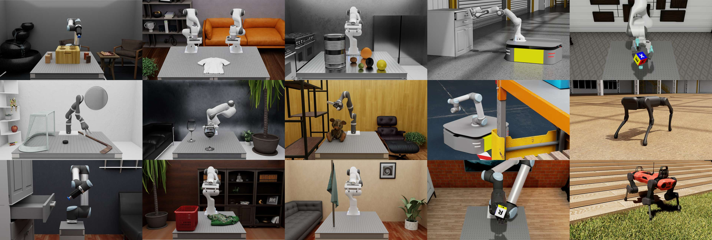

---

# Omniverse Isaac Orbit

[](https://docs.omniverse.nvidia.com/app_isaacsim/app_isaacsim/overview.html)
[](https://docs.python.org/3/whatsnew/3.7.html)
[](https://releases.ubuntu.com/20.04/)
[](https://pre-commit.com/)
[](https://isaac-orbit.github.io/orbit)
[](https://opensource.org/licenses/BSD-3-Clause)

<!-- TODO: Replace docs status with workflow badge? Link: https://github.com/isaac-orbit/orbit/actions/workflows/docs.yaml/badge.svg -->

Isaac Orbit (or *orbit* in short) is a unified and modular framework for robot learning powered by [NVIDIA Isaac Sim](https://docs.omniverse.nvidia.com/app_isaacsim/app_isaacsim/overview.html). It offers a modular design to easily and efficiently create robotic environments with photo-realistic scenes, and fast and accurate simulation.

Please refer our [documentation page](https://isaac-orbit.github.io/orbit) to learn more about the installation steps, features and tutorials.

## Contributing to Orbit

We wholeheartedly welcome contributions from the community to make this framework mature and useful for everyone. These may happen in
form of bug reports, feature requests, or code contributions. For details, please check our [contribution guidelines](https://isaac-orbit.github.io/orbit/source/refs/contributing.html).

## Troubleshooting

Please see the [troubleshooting](https://isaac-orbit.github.io/orbit/source/refs/troubleshooting.html) section for common fixes or [submit an issue](https://github.com/NVIDIA-Omniverse/orbit/issues).

For issues related to Isaac Sim, we recommend checking its [documentation](https://docs.omniverse.nvidia.com/app_isaacsim/app_isaacsim/overview.html), or opening a question on its [forums](https://forums.developer.nvidia.com/c/agx-autonomous-machines/isaac/67).

## Support

* Please use GitHub [Discussions](https://github.com/NVIDIA-Omniverse/Orbit/discussions) for discussing ideas, asking questions, and requests for new features.
* Github [Issues](https://github.com/NVIDIA-Omniverse/orbit/issues) should only be used to track executable pieces of work with a definite scope and a clear deliverable. These can be fixing bugs, documentation issues, new features, or general updates.

## Acknowledgement

NVIDIA Isaac Sim is available freely under [individual license](https://www.nvidia.com/en-us/omniverse/download/). For more information about its license terms, please check [here](https://docs.omniverse.nvidia.com/app_isaacsim/common/NVIDIA_Omniverse_License_Agreement.html#software-support-supplement).

ORBIT framework is released under [BSD-3 License](LICENSE). The license files of its dependencies and assets are present in the [`docs/licenses`](docs/licenses) directory.

## Citation

Please cite [this paper](https://arxiv.org/abs/2301.04195) if you use this framework in your work:

```
@misc{mittal2023orbit,
	author = {Mayank Mittal and Calvin Yu and Qinxi Yu and Jingzhou Liu and Nikita Rudin and David 	Hoeller and Jia Lin Yuan and Pooria Poorsarvi Tehrani and Ritvik Singh and Yunrong Guo and Hammad Mazhar and Ajay Mandlekar and Buck Babich and Gavriel State and Marco Hutter and Animesh Garg},
	title = {ORBIT: A Unified Simulation Framework for Interactive Robot Learning Environments},
	year = {2023},
	eprint = {arXiv:2301.04195},
}
```
